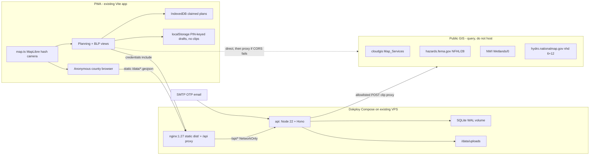
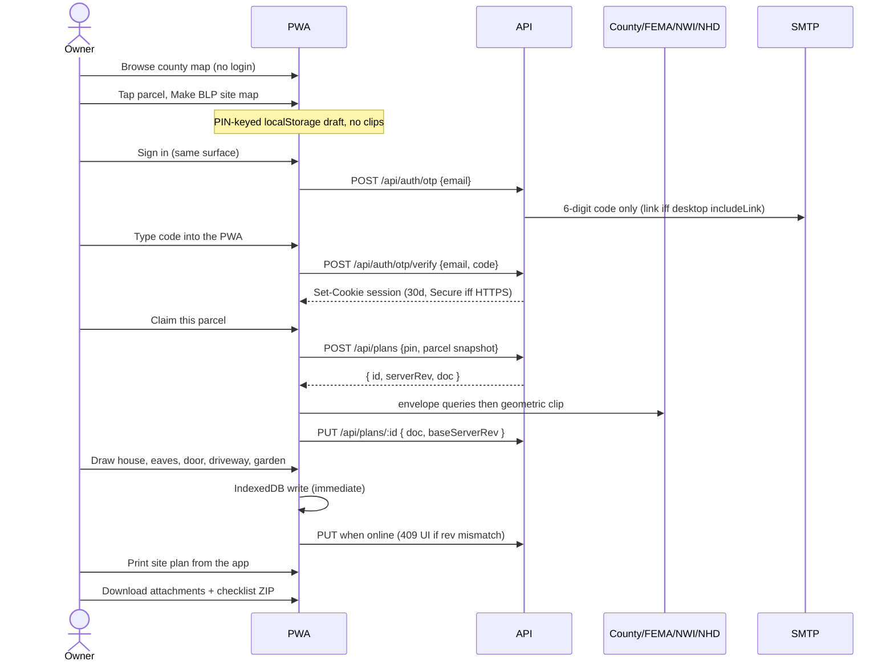
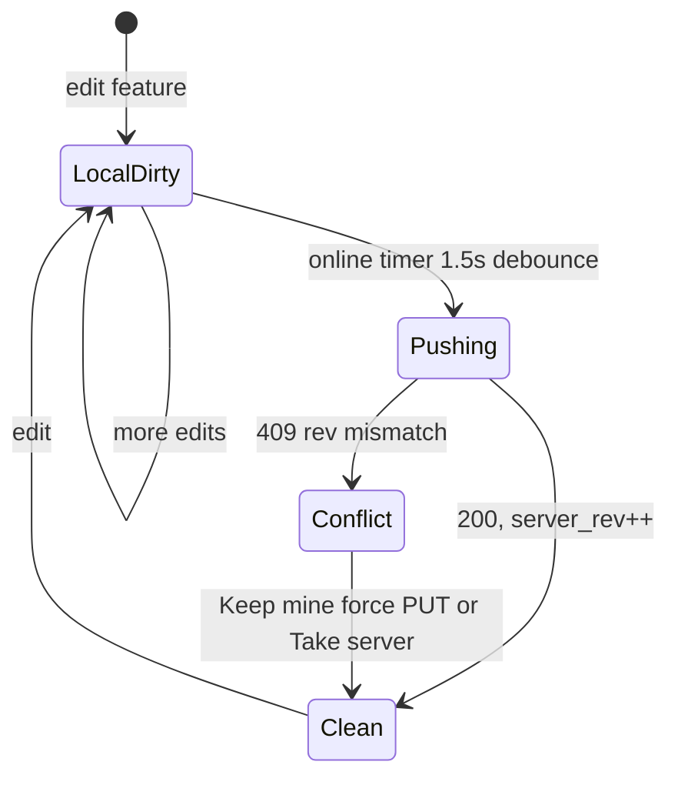

# Bonner Bounds: Claimed Parcel Map, BLP Packet, and Account Persistence

| Field | Value |
| --- | --- |
| **Document** | Design for persistent parcel planning + BLP site-plan packet |
| **Author** | TBD |
| **Date** | 2026-08-23 |
| **Revised** | 2026-08-23 (review pass 2) |
| **Status** | Draft |
| **Codebase** | `/home/david/grok/bonner` (Vite + TypeScript + MapLibre PWA) |
| **Audience** | Owner / implementing engineer who already knows this repo |

---

## Overview

Bonner Bounds is a static, county-wide parcel browser: ~45.7k Bonner County assessor parcels on MapLibre, with search, GPS, an offline pack, and a one-shot **BLP site map** draft. That draft lives in a module-level `site` object in `src/siteplan.ts` and dies on refresh. It can place one rectangle, a well, and a septic point, then `window.print()`. It cannot persist, cannot cover the county site-plan checklist, and cannot serve as a long-lived land-use plan.

This design keeps the **public county map working with no account**, and adds a small same-VPS API so a logged-in owner can **claim a parcel**, keep a **working land-use map** across phone and desktop, and produce a **BLP packet**: print the site plan from the PWA (11×17-friendly, with a Letter fallback), then download a login-gated ZIP of **attachments + checklist** (not a baked site-plan PDF). The app still does not file the permit — Tyler/EnerGov remains the official portal — and every distance taken from assessor geometry stays labeled **approximate / not a survey**.

The backend is deliberately small: one Node 22 container, SQLite on a Docker volume, **email one-time code (OTP)** typed back into the same surface that requested it, `server_rev` conflict (409 + Keep mine / Take server), no Kubernetes, no multi-tenant SaaS.

---

## Background & Motivation

### Current state

The production shape is documented in `README.md` and wired as:

```
Node 22 build (Dockerfile) → nginx:1.27 serving dist/ on :80 → Dokploy / Hostinger VPS
```

`docker-compose.yml` has a single `web` service. There is **no backend, no auth, no database**. County geometry is baked at image build time via `npm run data` (`scripts/fetch-parcels.mjs` + `scripts/build-tiles.mjs`) into `public/data/parcels.geojson` (~45,723 features as of `public/data/meta.json`, fetched 2026-08-17).

README today documents **Dokploy Build Type: Dockerfile** (one `web` image). This design **requires switching that Dokploy app to Compose** (two services + named volume). That cutover is part of PR 7, not an invisible ops detail.

What exists today that this design must extend, not replace:

| Surface | Where | Behavior |
| --- | --- | --- |
| County map | `src/map.ts` `createMap` / `addDataLayers` | Satellite (Esri), USGS topo, dark canvas; private red lines, public-land tint from owner classifier. **`hash: true`** — MapLibre owns `location.hash` as `#{zoom}/{lat}/{lng}`. Do not put app routes in the hash. |
| Search / GPS / offline | `src/search.ts`, `src/main.ts` `bindLocate`, `src/offline.ts` | Address / owner / PIN; follow-me; Cache API pack of parcels + USGS topo z7–13. Search result buttons use `btn.innerHTML` with owner/address strings (XSS surface; plan notes must not follow that pattern). |
| Parcel card | `index.html` `#parcel-card` | PIN, acres, class, assessed value, **`deed`** (GIS field `deed1` is renamed in `scripts/fetch-parcels.mjs` to `ParcelProps.deed`), land kind, **assessor-not-a-survey** disclaimer |
| BLP draft | `src/siteplan.ts` + `src/setbacks.ts` + `#siteplan-panel` | Select parcel → **Make BLP site map** → one 40×60 ft rectangle + well/septic points → zoning query → print. `startSitePlan` **wipes** `site.marks`; `exitSitePlan` also clears them. |
| Print | `index.html` `#print-block` + `src/style.css` `@media print` | Letter portrait; map ~7.4 in; meta / distances / notes; no signature, no 11×17. `.north` has class `no-print`; print CSS hides `.no-print { display: none !important; }` and a later `.north { display: grid }` **without** `!important`, so the **north arrow is hidden in print today**. `ScaleControl` is bottom-left and is not in the hide list. `fillPrintBlock()` / `renderDistances()` `.slice(0, 8)` and `distanceSummary()` drops edges `< 15 ft`. |
| Zoning | `src/setbacks.ts` `fetchZoningAt` | Point query of `ZoningLanduse_Public/MapServer/2`: `f=json`, `returnGeometry=false`, `outFields=zonedesc`. This is **not** the clip query (clips need geometry + `f=geojson`). `ruleForZone` maps BCRC 12-411/12-412 typical 25 ft / accessory 5 ft |

The in-memory model is a singleton:

```30:58:src/siteplan.ts
export interface SiteState {
  active: boolean;
  parcel: ParcelProps | null;
  geom: Polygon | MultiPolygon | null;
  zoning: string | null;
  rule: SetbackRule;
  lineFt: number;
  accessory: boolean;
  marks: SiteMark[];
  selectedId: string | null;
  placeMode: PlaceMode;
  use: string;
  notes: string;
}

export const site: SiteState = {
  active: false,
  // ...
  use: "Single-family dwelling",
  notes: "",
};
```

`SiteKind` is only `"structure" | "well" | "septic"`. `addMark` refuses anything outside the parcel (`pointInParcel`). `refreshOverlays` draws **one** structure rectangle via `rectanglePolygon` (`site.marks.find` of kind structure) and labels edge lengths + distance-to-building with `minDistToEdgeFt`. Closing the panel (`exitSitePlan`) wipes `site.marks`.

Assessor PINs in `public/data/search-index.json` are not `\w-` only. Live file (this workspace): 19 PINs contain `*` (e.g. `SC*LH000S214J0A`), 2 contain `/` (`RPS7311A/B00A0A`, `RPS7311A/B00B0A`), **439 empty PINs**, one literal `ROW`. Max length 15. Any claim validator must accept the snapshot string, not `/^[\w-]+$/`. Empty and `ROW` are rejected.

### Pain points

1. **Work is disposable.** Refresh, SW update, or “clear site data” destroys the only BLP draft. Phone and desktop cannot share it.
2. **The draft is not a BLP site plan.** BCRC 11-105 and the March 28, 2024 *Building Location Permit Submission Checklist* require property-line dimensions, greatest architectural projections (eaves/decks count as the building), distances from those projections to **every** property line, front door, all existing **and** proposed structures, septic **tank + leach field** + well, driveway / primary access and all roads providing access, easements of record, water within 300 ft, wetlands, slope, north arrow, scale, and an owner signature. The current UI covers a subset of that as notes-and-hope.
3. **No land-use planning surface.** The owner wants a durable working map (garden, timber, shop yard, well, driveway) that *also* feeds the permit drawing — not a one-shot print.
4. **No account**, so there is nowhere honest to put that document.

### Legal constraint (non-negotiable)

`README.md`, `#parcel-card`, `#siteplan-panel`, and `#print-block` already say the assessor map is **not a survey**. Distances from `parcels.geojson` (county `Cadastral_Public/MapServer/0`, 6-decimal GeoJSON) can be off by many feet. This design **does not** claim survey accuracy, does **not** file the BLP, and does **not** issue fire, health, encroachment, flood, or wetland permits. Those stay checklist items with links to the county.

---

## Goals & Non-Goals

### Goals (v1)

1. Public county browser, search, GPS, layers, and offline pack keep working **with no login**.
2. A logged-in user can **claim one or more PINs** and persist a **plan document** (features + notes + geometrically clipped constraint layers + checklist) across devices.
3. The same plan document drives two views:
   - **Land-use planning map** — existing vs proposed buildings, access, well/septic/leach, use-area polygons, constraint overlays, notes.
   - **BLP packet map** — county-checklist site plan printed **from the PWA** (11×17 CSS with Letter fallback; on iOS the user must pick Tabloid if they want 11×17), owner signature block, remaining-attachment checklist. The login-gated ZIP is **attachments + checklist only**, labeled as such — it is not the drawing.
4. Floor plans and elevations are **uploaded attachments**, not an in-app CAD editor. iPhone HEIC is accepted (or the UI tells the user to Export as JPEG).
5. Stay on the existing Dokploy/Hostinger VPS: switch the Dokploy app from Dockerfile-only to **Compose**; add one API container beside nginx; SQLite on a named volume.
6. Phone-first PWA: **login inside the home-screen app** (OTP typed back in), edit, and print must work there. Safari and the standalone PWA do not share cookies.
7. Flaky cell: a claimed plan is editable offline; v1 conflict rule is **`server_rev` 409**, not clock-based LWW.
8. GIS overlays come from **existing public MapServer layers** (county + FEMA + NWI + USGS NHD), not invented geometry. Gaps are called out as user-drawn or checklist-only. Persist only **geometrically clipped** envelopes, never raw county-scale polygons.

### Non-goals (v1)

- Multi-tenant SaaS, orgs, billing, roles beyond “the account that owns the plan.”
- Filing a BLP on Tyler/EnerGov, or pretending the app *is* the permit.
- Survey-grade COGO, snapping to found monuments, or legal descriptions other than the assessor **`deed`** string already on `ParcelProps` (source GIS field `deed1`).
- A floor-plan / elevation CAD editor; server-side HEIC→JPEG transcode; Chromium on the VPS.
- Verifying that the logged-in email is the assessor owner of record.
- Kubernetes, a separate cloud database, or a second domain for the API.
- County-wide precompute of flood/wetland/slope for all 45k parcels.
- Real-time collaborative editing, comments, or sharing a plan by URL (schema leaves room later).
- Password accounts, social SSO as the primary path, or email-change / account-deletion self-serve beyond a documented operator procedure.

---

## Key Decisions

| # | Decision | Rationale |
| --- | --- | --- |
| D1 | **Public map stays anonymous.** Login is required only to claim a PIN, persist a plan, and download the attachments ZIP. Anonymous users keep a BLP sketch (now PIN-keyed localStorage, no clips). | Product constraint; 45k-parcel browser is the existing public good. |
| D2 | **One plan document, two views** (`planning` / `packet`) over the same GeoJSON feature list. | Avoids two sources of truth; BLP packet is a filtered, labeled print of the working map. |
| D3 | **Email OTP typed into the same surface that requested it** (6-digit, 15 min, hashed). **Emails are code-only by default** — no login URL on iPhone. Desktop sign-in may set `includeLink: true`. Session is HttpOnly cookie; **never** store the session token in IndexedDB. `APP_ORIGIN` is a full origin (`https://example.com`). Cookie `Secure` is derived **only** from `APP_ORIGIN` (https → Secure; http localhost → not). Rate-limit **both** `otp` and `otp/verify`. | iOS Mail opens links in Safari; a URL in the OTP email would re-trap the user into a Safari session while the PWA stays logged out. `$scheme` behind Dokploy is `http` and must not decide `Secure`. |
| D4 | **SQLite (WAL) on a Docker volume**, `better-sqlite3`, one `api` container. Plans stored as versioned JSON; attachments as files. `PRAGMA foreign_keys = ON` on **every** connection (not only in the migration file). | One user (maybe a handful); Postgres and object storage are ops without benefit. Schema still has `users.id` so a second account is an INSERT, not a rewrite. SQLite foreign keys default **off** in `better-sqlite3`. |
| D5 | **Claim = `(user_id, pin)` unique**, not a county-wide lock on the PIN. Snapshot parcel geom + **`ParcelSnapshot` in `shared/plan.ts`** (`pin` verbatim). Reject empty / `ROW`; length 1–32; allow `*` and `/`. Do **not** import `src/types.ts` `ParcelProps` into `shared/` or the API. | “Claim” is “I am planning this lot,” not title. Live PINs include `SC*LH…` and `RPS7311A/B00A0A`. The API image does not copy `src/`. |
| D6 | **Constraint clips: spatial query, then geometric clip** to parcel⊕300 ft, then persist on **claimed** plans only (SQLite + IndexedDB). Never put clips in localStorage. **Always** send Esri `maxAllowableOffset≈5 m`. Caps: 200 features and 500 KB encoded per layer; overflow or turf throw → `{ incomplete: true }`. PR 4 adds `@turf/intersect` and `@turf/bbox-clip` to root `package.json`. | Esri still ships the whole lake on the wire; generalization + clip + catch keeps PR 4 implementable. |
| D7 | **Use county public layers where they exist; federal layers where they do not; user-drawn for the rest.** Frozen URLs in the overlay table. Never invent a wetlands or flood layer of our own. | Honesty. County `Map_Services` has no flood, wetland, hydro, slope, or easement-of-record layer. |
| D8 | **Architectural projections = structure rectangle buffered by `eaveFt` (default 2 ft, editable).** Distances to lot lines are measured from that envelope, matching BCRC 11-105 “greatest architectural projections.” | Current `minDistToEdgeFt` already measures rectangle vertices to edges; buffering is the smallest honest model of eaves/decks without a CAD tool. |
| D9 | **Conflict = `server_rev` only.** PUT with matching `baseServerRev` commits (`server_rev++`). Mismatch → **409** + server row. UI: **Keep mine** (`force: true`, using the 409’s `serverRev` as the new base) or **Take server**. Server `updated_at` is display-only. Client clocks are not a conflict key. Attachments are append/tombstone (new id per POST), not this algorithm. | The previous text specified three different LWW rules. One algorithm; no 409-less auto-merge; no phone-date wins. |
| D10 | **nginx continues to serve the PWA independently of API health.** Reverse-proxy `/api/` with Docker DNS `resolver 127.0.0.11` + variable `proxy_pass`. **`web` must not `depends_on: service_healthy`.** Vite dev server gets the same `/api` proxy. Same origin. | Goal 1: a down API 502s `/api/` only. Waiting on API health at compose-up takes the county map with it. |
| D11 | **Do not cache `/api/`.** Workbox `NetworkOnly` + `navigateFallbackDenylist: [/^\/api/]` and `offline-sw.js` ignore `/api/` land in **PR 7** with the proxy, not later. Callback query strings are not written to nginx `access_log`. | Today’s SW is cache-first for same-origin GETs. A navigation fallback to `index.html` would swallow `/api/auth/callback`. |
| D12 | **One `shared/plan.ts`** with a self-contained `ParcelSnapshot` (no import from `src/types.ts`). Vite imports it via alias. The **API is esbuild-bundled** (`--bundle --platform=node --external:better-sqlite3`) so `shared/` is inlined and the runtime image has no sibling `shared/` or `rootDir` fight. PR 1 lands types (no Zod). PR 7 adds Zod to **this same file** and adds **`zod` to root `package.json`** (Vite already compiles `shared/`) plus `api/package.json`. | `PlanDoc.parcel.props: ParcelProps` would fail the API image (`Dockerfile.api` does not copy `src/`). Default `tsc` `rootDir` also breaks that layout. |
| D13 | **Dokploy app switches from Build Type Dockerfile to Compose.** Named volume `plan-data` for live SQLite + uploads. **Same-volume `.backup` is only a SQLite-corruption hedge.** Recovery from a dropped volume requires an **off-`plan-data` copy**: second volume `plan-backups` **and** an operator off-box copy (Dokploy/Hostinger snapshot or `docker cp`). Hostinger snapshot behavior is **unverified**. | Two containers + a volume cannot be expressed as the current single-Dockerfile app. Backups on `plan-data` die with `plan-data`. |

---

## Proposed Design

### High-level architecture



Anonymous traffic never hits the API. The existing `web` image still builds parcels at `docker build` time (`Dockerfile` lines 13–17) and still serves `/data/` with 86400s cache.

### User flows



Post-login: redirect (desktop callback only) to `APP_ORIGIN/?login=ok`. Client reads `GET /api/me` and `sessionStorage.loginOk`, then **strips the query** with `history.replaceState` **before** `createMap` (MapLibre `hash: true` must not see a competing hash, and `?login=ok` must not linger). Never `#claimed`.

### Two surfaces, one document

After a parcel is claimed, `#siteplan-panel` becomes a **plan sheet** with a view toggle:

| View | Purpose | Default visible features |
| --- | --- | --- |
| **Plan** | Long-lived land-use working map | All kinds, including `use_area`; constraint fills on |
| **Packet** | What goes to Planning | Existing + proposed structures (eave envelope), well, septic, leach, driveway, roads, easements, water/wetlands, setbacks; use-areas hidden unless “show on packet” is checked |

Both views call the same `refreshOverlays(map)` against `plan.features`. Packet mode only changes filters, labels, print CSS, and the checklist.

Anonymous **Make BLP site map** remains. A banner: “Sign in to save this plan.” Signing in + claiming hydrates the PIN-keyed localStorage draft into `POST /api/plans`.

### Frontend module layout

Keep the current files; add, do not boil the ocean.

| File | Change |
| --- | --- |
| `src/types.ts` | Unchanged parcel/search types (`deed`, not `deed1`) |
| `shared/plan.ts` | **New, one copy, no import from `src/`.** Types in PR 1 (`ParcelSnapshot` lives here). Zod `PlanDoc` schema added in PR 7 in the **same** file; add `zod` to **root** `package.json` then. Vite alias `@shared/plan` → `shared/plan.ts`. API **esbuild-bundles** this file; do not `tsc`-emit a sibling `shared/` into the runtime image. Root `tsconfig.json` `include`: `["src", "shared"]`. |
| `src/siteplan.ts` | Generalize `SiteState` → wrap `PlanDoc`; multiple features; eave buffer; driveway draw; use-areas. **`startSitePlan` restores a same-PIN draft** instead of wiping marks. **`exitSitePlan` hides UI and writes the draft; it does not drop it.** |
| `src/setbacks.ts` | Keep `fetchZoningAt` / `ruleForZone` as the **point / no-geometry** zoning label query. Shoreline 40/75 ft helpers use NHD FCode after clip. |
| `src/constraints.ts` | **New.** Envelope query + **geometric** clip; caps; `incomplete`; never write clips to localStorage. |
| `src/plan-store.ts` | **New.** IndexedDB + `fetch` sync with `server_rev` / 409. |
| `src/auth.ts` | **New.** OTP request + verify, `GET /api/me`, logout. Optional desktop callback. |
| `src/packet.ts` | **New.** Print layout, scale statement, signature block, checklist, attachments ZIP download (not a site-plan PDF). |
| `src/map.ts` | New GeoJSON sources/layers for constraints, use-areas, driveways, eaves; keep county layers as they are. Construct the map only after stripping `?login=ok`. |
| `src/main.ts` | Bind login chrome, claim button, view toggle, attachment list; do not gate `boot()` on auth. Plan notes via `textContent` only. |
| `src/offline.ts` / `vite.config.ts` | Exclude `/api/` from cache-first **in PR 7**. |
| `index.html` | Sign-in control, plan sheet, packet checklist, signature line. Remove `no-print` from `.north` (or print-override with `!important`). |
| `src/style.css` | 11×17 print page; Letter fallback class; keep `.disclaimer`. |

`site` remains a mutable singleton so existing `bindSitePlan` click handlers stay simple. It gains `planId`, `serverRev`, `view`, and a `features: PlanFeature[]` in place of `marks: SiteMark[]`.

### Plan feature model (client)

```ts
// shared/plan.ts — v1 document. Server stores this JSON verbatim after Zod parse.
// PR 1: types only (no Zod, no import from src/types.ts).
// PR 7: add Zod PlanDocSchema in THIS file; add `zod` to root package.json.
// API: esbuild-bundle so this module is inlined. Vite: alias @shared/plan.

export const PLAN_DOC_VERSION = 1 as const;

/** Persisted parcel fields. Do not import ParcelProps from src/types.ts. */
export interface ParcelSnapshot {
  pin: string;
  o1: string;
  o2: string;
  acres: number;
  cls: string;
  value: number;
  tax: string;
  deed: string;
  land: string; // copy of LandKind at snapshot time
  addr?: string;
  addrs?: string;
  naddr?: number;
}

export type FeatureStatus = "existing" | "proposed";
export type FeatureKind =
  | "structure"
  | "well"
  | "septic"
  | "leach"
  | "driveway"
  | "easement"
  | "water"
  | "wetland"
  | "use_area"
  | "note"
  | "front_door";

export type UseAreaClass =
  | "garden"
  | "pasture"
  | "timber"
  | "shop_yard"
  | "orchard"
  | "other";

export interface PlanFeature {
  id: string;                 // crypto.randomUUID()
  kind: FeatureKind;
  status: FeatureStatus;
  label: string;
  geom: GeoJSON.Geometry;     // Point, LineString, Polygon
  onPacket: boolean;          // default true except use_area
  props: {
    widthFt?: number;
    lengthFt?: number;
    rotationDeg?: number;
    eaveFt?: number;          // structure only; default 2
    useClass?: UseAreaClass;
    source?: "user" | "county" | "fema" | "nwi" | "nhd";
    notes?: string;
  };
}

export interface LayerClip {
  type: "FeatureCollection";
  features: GeoJSON.Feature[];
  incomplete: boolean;
  fetchedAt: string;
  truncatedReason?: "feature_cap" | "byte_cap" | "timeout" | "cors" | "too_large_source";
}

export interface ConstraintClip {
  zoning: { zonedesc: string | null; fetchedAt: string };
  roads: LayerClip;
  drivewaysCounty: LayerClip;
  row: LayerClip;
  flood: LayerClip;       // NFHL FLD_ZONE, clipped
  wetlands: LayerClip;    // NWI, clipped
  water: LayerClip;       // NHD 6+12, clipped
  cityImpact: LayerClip;  // ZoningLanduse layer 0
}

export interface PacketChecklistItem {
  id: string;
  label: string;
  required: boolean;
  status: "open" | "attached" | "na" | "external";
  attachmentId?: string;
  href?: string; // county URL when external
}

export interface PlanDoc {
  version: typeof PLAN_DOC_VERSION;
  pin: string;
  title: string;
  use: string;
  notes: string;
  lineFt: number;
  accessory: boolean;
  parcel: {
    props: ParcelSnapshot; // pin verbatim; mapped from ParcelProps at claim time
    geom: GeoJSON.Polygon | GeoJSON.MultiPolygon;
    snapshotAt: string;
  };
  features: PlanFeature[];
  constraints: ConstraintClip | null; // claimed plans only; null in localStorage drafts
  checklist: PacketChecklistItem[];
  // NOT a conflict key. Display / debugging only.
  clientEditedAt?: string;
}
```

**Structure geometry:** keep the current rectangle editor (`widthFt` / `lengthFt` / `rotationDeg` / center) because it is phone-usable. Persist the derived Polygon. The **permit envelope** is `buffer(structurePoly, eaveFt, { units: "feet" })` using the already-imported `@turf/buffer` (`src/geo.ts` `inwardSetback` uses the same helper inward).

**Distances:** `distanceSummary(structureId?)` measures **envelope → every outer-ring edge** (no `lengthFt >= 15` filter, no `.slice(0, 8)` on the **packet** table). On-screen inspector may still show the closest 8 for the **selected** structure. Packet table: **one block per structure**, every outer-ring edge. UI copy: “Distances are from greatest projections (eaves/decks), approximate from the assessor map.”

**Front door:** a `front_door` Point. Snap to the nearest point on the selected structure’s eave envelope if the tap is within **12 ft**; otherwise reject and set `#status` to “Tap on the building edge (door must sit on the wall/eave).” Packet labels it “Front door”.

**Driveway:** a LineString drawn as tap-vertices, **allowed to start outside the parcel** so it can meet `Transportation_Public` road centerlines. This is a deliberate break from `addMark`’s `pointInParcel` guard, which is wrong for access.

**Septic:** keep a `septic` Point (tank) and add an optional `leach` Polygon. Advisory distance well→septic (Panhandle Health commonly 100 ft) is computed with existing `feetBetween` and shown as a warning, not a permit.

**Use areas:** Polygon + `useClass`. Fill-hatched, labeled, off the packet by default.

**Easements:** user-drawn Polygon/LineString. County **ROW** (`Cadastral_Public/MapServer/5`) is an overlay, not a substitute for “easements of record” — that layer’s fields are only `objectid` + shape (no type, no recorded instrument). The packet always includes a checklist line: “All easements of record — confirm against the deed; GIS ROW is not a title report.”

### GIS overlays — what we have and what we do not

Bonner County public services (verified 2026-08-23):

`https://cloudgis.bonnercountyid.gov/server/rest/services/Map_Services`

| Service | Layer | Use in v1 |
| --- | --- | --- |
| `Cadastral_Public` | 0 Parcels | Already the app (`scripts/fetch-parcels.mjs`). Snapshot on claim. |
| `Cadastral_Public` | 1 Lots, 3 Blocks, 4 Subdivisions | Optional context overlay; not required for BLP. |
| `Cadastral_Public` | 5 ROW | Overlay on plan/packet. Geometry only; **not** easements of record. |
| `Addressing_Public` | 0 Structure | Already joined into parcels as `addr`. Show structure points on the planning map as “911 address point (existing).” Snapshot-on-claim for offline (Open Question 7, leaning yes). |
| `Addressing_Public` | 1 Driveway | Overlay existing county driveway polylines (`Permissions` field). User still draws proposed access. |
| `Transportation_Public` | 3 Road Centerlines | Overlay “all public or private roads providing access.” Encroachment trigger uses 3, 4, 5, 7. |
| `Transportation_Public` | 4 County Maintained, 5 USFS Roads, 7 Street Ownership | Optional layer toggles + encroachment. |
| `ZoningLanduse_Public` | 2 Current Zoning | **Label** still via `fetchZoningAt` (point, `f=json`, no geometry). **Fill** via clip query (`f=geojson`, return geometry) of the same layer. Zones present: Alpine Village, Recreation, Suburban, Commercial, Rural Service Center, Industrial, R-5, R-10, A/f-10, A/f-20, Forest 40. |
| `ZoningLanduse_Public` | 0 Area of City Impact | Overlay + checklist warning (city standards may apply). |
| `ZoningLanduse_Public` | 1 Current Land Use | Optional planning overlay. |

**Not in county `Map_Services` (do not pretend they are):**

| Need | v1 source (frozen) | Notes |
| --- | --- | --- |
| Floodplain / floodway | FEMA NFHL `https://hazards.fema.gov/arcgis/rest/services/public/NFHL/MapServer/28` (`FLD_ZONE`) | If any SFHA intersects the **clipped** parcel envelope or the proposed structure envelope, checklist forces Floodplain Development Permit (Title 14) to `open`. |
| Wetlands | USFWS NWI `https://fwspublicservices.wim.usgs.gov/wetlandsmapservice/rest/services/Wetlands/MapServer/0` | “Wetlands on site” for BCRC 11-105 / 12-730. NWI is **not** a delineation. |
| Water bodies within 300 ft | USGS NHD **Large Scale**, `https://hydro.nationalmap.gov/arcgis/rest/services/nhd/MapServer` layer **6** (Flowline) and **12** (Waterbody) | Open Question 4 is **closed** on these two layers. Buffer proposed structure (fallback: parcel) by 300 ft; list names/`gnis_name`/`FCODE` on the packet. |
| Shoreline 200 ft worksheet trigger | Same NHD 6+12, 200 ft buffer of parcel | Sets Shore Land Development Worksheet checklist item (`BCRC 12-710`). |
| Shoreline **setback** | BCRC 12-711: **40 ft** from lakes/ponds/Pend Oreille/Clark Fork/intermittent NHD; **75 ft** from other flowing streams | Drawn as a dashed buffer on clipped NHD. **FCode rule:** waterbody (layer 12) and intermittent flowline FCodes → 40 ft; other flowline (layer 6) → 75 ft. User can override after field inspection (code allows survey/field over NHD). |
| Wetland setback | **Verify current Title 12 at implement time** (historical table used 40 ft; do not treat 40 ft as confirmed ordinance text) | Advisory overlay on clipped NWI; labeled “verify with Planning.” |
| Slope / geotech | Visual USGS topo / optional MapLibre hillshade; **no** county slope polygon | Checklist item “Mapped steep slopes? Geotech per BCRC 12-760.” User marks yes/no. Do not compute 30% slopes in v1. |
| Easements of record | User-drawn + deed PDF attachment | ROW layer is extra, not sufficient. |
| Fire district | No public layer in `Map_Services` (other folders 401) | Checklist + link to county Fire District Sign Off page. Any “districts paused” copy is **verify on county site at implement time**, not baked in as fact. |
| Address assignment | County 911 structures already in data | Checklist `BCRC 13-120` if `naddr` is 0 / no `addr`. |

**Two query styles — do not conflate:**

| | Zoning label (`fetchZoningAt`) | Constraint clip (`src/constraints.ts`) |
| --- | --- | --- |
| Geometry | Point at centroid | Envelope polygon = `buffer(parcel, 300, { units: "feet" })` |
| `f` | `json` | `geojson` |
| `returnGeometry` | `false` | `true` |
| `geometryPrecision` | n/a | `6` (same as `scripts/fetch-parcels.mjs`) |
| `outFields` | `zonedesc` | allowlisted per layer (see GIS proxy table) |
| Pagination | none | `resultRecordCount=200`, `resultOffset` until empty, cap, or `exceededTransferLimit` |

**Clip algorithm (this is what “clip” means — implement in `src/constraints.ts` and the API proxy):**

1. `envelope = buffer(asPolygon(parcelGeom), 300, { units: "feet" })`. On throw (invalid assessor ring), fall back to `bbox(parcel)` expanded ~300 ft in degrees and set `incomplete: true` / `truncatedReason: "too_large_source"` (used here as “geom failed”).
2. Query with `geometry` = envelope GeoJSON (preferred) or bbox, `esriSpatialRelIntersects`, `outSR=4326`, `geometryPrecision=6`. **Always** send `maxAllowableOffset=0.00005` (~5 m) so Pend Oreille / NFHL are generalized **on the wire**, not only after a 1 MB failure.
3. Paginate `resultOffset` by 200. Stop at **200 features** kept **after** step 4, **500 KB** encoded JSON per layer, **8 s** wall time, **~2 MB** raw upstream, or no more records.
4. For each feature, `turf.intersect(feature, envelope)` (polygon) or `turf.bboxClip` against envelope (line/point). Drop null. Wrap each call in try/catch; on throw, skip that feature and mark the layer incomplete. This is what keeps Pend Oreille at a sliver **in storage**.
5. If we stop early, set `incomplete: true` and `truncatedReason`. Still persist what we have. Checklist treats incomplete flood/wetland/water as “verify — overlay incomplete,” never as “clear.”
6. **Do not** write `constraints` into localStorage. Anonymous overlays, if fetched at all, live in memory for the session. Claimed plans store clips on `PlanDoc` in IndexedDB + SQLite.

PR 4 **must** add `@turf/intersect` and `@turf/bbox-clip` to **root** `package.json` (not in the repo today; `@turf/buffer` already is).

**CORS:** headers on FEMA / NWI / NHD from a browser are **unverified**. PR 4 **probes** (`fetch` + `TypeError` vs HTTP error) before assuming direct access. Direct first (as zoning already does). On CORS/network fail: mark that layer `incomplete` / `cors`. The auth-gated proxy (PR 11, after PR 8) is the fallback — PR 4 does **not** wait for it, and does **not** claim FEMA/NWI work until the probe says so.

**When overlays run:** persisted clips are **claimed-plan only** (matches rollout). Anonymous site plan may best-effort query for display; results stay in RAM.

### GIS proxy contract

`POST /api/gis/clip` (auth required). **No user URL. No loose county-wide bbox from the client.** Body: `{ src, layer, planId }` — server loads the plan’s parcel snapshot, builds the 300 ft envelope itself, queries, clips, caps, returns `LayerClip`.

| `src` | Allowed base URL prefix | Allowed `layer` ids | `outFields` |
| --- | --- | --- | --- |
| `county-cadastral` | `https://cloudgis.bonnercountyid.gov/server/rest/services/Map_Services/Cadastral_Public/MapServer/` | `5` (ROW); optional `1,3,4` | `objectid` |
| `county-address` | `…/Addressing_Public/MapServer/` | `0`, `1` | `fulladdr,Permissions` |
| `county-trans` | `…/Transportation_Public/MapServer/` | `3,4,5,7` | `fullname,fullname_abbr,roadclass` (layer 3 display field is `fullname`; verified 2026-08-23) |
| `county-zoning` | `…/ZoningLanduse_Public/MapServer/` | `0,1,2` | `zonedesc` |
| `nfhl` | `https://hazards.fema.gov/arcgis/rest/services/public/NFHL/MapServer/` | `28` | `FLD_ZONE,ZONE_SUBTY` |
| `nwi` | `https://fwspublicservices.wim.usgs.gov/wetlandsmapservice/rest/services/Wetlands/MapServer/` | `0` | `WETLAND_TYPE,ATTRIBUTE` (or whatever the layer actually names — read fields at implement, still allowlist) |
| `nhd` | `https://hydro.nationalmap.gov/arcgis/rest/services/nhd/MapServer/` | `6`, `12` | `gnis_name,FCODE,FTYPE` |

Reject anything else (path `..`, extra query, other hosts) with 400. Timeout 8 s. Max upstream bytes ~2 MB then abort. Apply the same geometric clip + 200 / 500 KB caps. One logged-in user can still pull overlays for **their** parcels only (`planId` must be owned). This is not a general Esri accelerator.

### Setbacks (keep and extend `src/setbacks.ts`)

Current `RULES` already encode typical **25 ft street and property line** for R-5 / R-10 / Suburban / Rec / Alpine / commercial, accessory **5 ft**, and a comment that A/F non-residential is often 40 ft. v1 changes:

- Continue to **default `lineFt` from `ruleForZone`**, user-editable (today’s `#site-setback`).
- Draw **street setback vs line setback as one inward buffer** for v1 (both 25 ft in the common residential case). Packet copy **must say so**: “Street and property-line setbacks are drawn as a single inward buffer (typical 25 ft in this zone). v1 does not split street frontage from side/rear lines.”
- Add **shoreline** and **wetland** buffers as additional dashed polygons, not as a replacement of `inwardSetback`.
- Flag a side “short of setback” when envelope-to-edge + 0.5 ft < `lineFt` (already the UI color in `renderDistances`).
- Copy on the packet: “Typical BCRC 12-411 / 12-412 figures. Confirm with Planning (208-265-1458). Architectural projections must not enter the setback.”

### Drawing UX (phone-first)

Reuse the existing place-mode pattern in `bindSitePlan` (`arm("place-structure", "structure")` etc.):

- **Place structure / well / septic / door** — single tap (current). Door snap 12 ft as above.
- **Draw driveway / leach / use-area / easement** — tap vertices, **Finish** button; double-tap or “Finish” closes a polygon.
- Selected feature inspector: label, existing/proposed, size, rotation, eave ft, delete (current Delete/Backspace handler).
- Constraint layer toggles live in `#layers-panel` when a **claimed** plan is active (Flood, Wetlands, Roads, ROW, Shoreline 200 ft, Water 300 ft).
- North arrow: remove `no-print` from `.north` **or** in the print PR set `.north { display: grid !important; }` so it wins over `.no-print { display: none !important; }`.
- Scale: keep `ScaleControl({ unit: "imperial" })` visible in print, plus an explicit statement `1 in ≈ X ft at this zoom` from map bounds, plus **“Assessor geometry — distances approximate, not to survey scale.”** If the user zooms such that a stated ratio would mislead, print **“NOT TO SCALE — use labeled distances.”**

**Encroachment trigger:** a proposed `driveway` LineString “meets” a road if `nearestPointOnLine` distance to any feature in Transportation layers 3, 4, 5, or 7 (clipped) is **≤ 30 ft**. That sets the encroachment checklist item to `open`, never “issued.”

### Packet / print

Replace letter-only print with a packet layout:

1. **Site plan page** — default CSS `@page { size: 11in 17in landscape; }` with a **Letter fallback** toggle (`size: letter portrait` as today). **iOS Safari / home-screen PWA print UI often ignores `@page` size and offers Letter.** Copy on the print button: “On iPhone: Print → Paper Size → Tabloid / 11×17 if you want that sheet. Letter still works; use the labeled distances.” Map occupies the sheet; `#print-block` becomes a title block along the bottom/right:
   - Owner name (`o1` / `o2`), address, PIN, acres, zoning, proposed use, date
   - Table: **every structure**, **every outer-ring property line** (compass + length) and distance from **that structure’s eave envelope** (drop today’s `.slice(0, 8)` and `< 15 ft` filter on this table)
   - North arrow, scale statement, setback used, **single-buffer** explanation
   - **Owner signature / date lines**
   - Prominent disclaimer (existing print-disclaimer text, plus “This is not the official BLP application. File at bonnercountyid.gov/building-location-permit”)
2. **Checklist page** — always-required vs maybe-required items (see below).
3. **Attachments** — listed with filenames; not rasterized into the map.

`fillPrintBlock()` in `src/main.ts` is the hook to replace. `window.print()` stays the **only** site-plan PDF path (iOS share → Save PDF).

**Named download** (`GET /api/plans/:id/attachments.zip`): login-gated ZIP of `checklist.json` + uploaded files + `README.txt` (“Print the site plan from Bonner Bounds; this ZIP is not the drawing”). **UI label:** “Download attachments and checklist.” Do not call this “the BLP packet PDF” or imply it contains the map.

### Packet checklist (always vs often)

Always required (from BLP Submission Checklist 03.28.2024 + BCRC 11-105):

| Item | App behavior |
| --- | --- |
| Site plan per 11-105 & 11-216 | Printed from this app |
| Diagrammatic floor plan 11-105 & 11-204 | Upload (PDF / JPEG / PNG / HEIC), no editor |
| Elevation drawings 11-105 | Upload |
| Deed or recorded legal description | Upload; prefill **`props.deed`** as a label only |
| Fire District approval 11-110 | External; status `external` + county URL. Pause/outage notes: **verify on county site at implement time** |
| Fees | External; Title 11 fee schedule link |

Often needed (overlays **suggest**, never auto-clear):

| Item | Trigger |
| --- | --- |
| Address assignment BCRC 13-120 | No 911 `addr` on parcel |
| Encroachment permit (Road & Bridge / IHD / ITD) | Proposed driveway within **30 ft** of Transportation 3/4/5/7 |
| Erosion / stormwater BCRC 12-720 | User checkbox “disturbance above threshold” (we do not compute acreage of cut) |
| Shore Land Development Worksheet BCRC 12-710 | Clipped NHD water within 200 ft |
| Wetland delineation BCRC 12-730 | Clipped NWI intersects parcel |
| Floodplain Development Permit + stamped plans Title 14 | Clipped NFHL SFHA intersects parcel or envelope |
| Geotech BCRC 12-760 | User checkbox “steep slopes on site” |
| Panhandle Health / sewer district | Well or septic present |
| ADU / RV / commercial extra standards | Use string matches ADU/RV/commercial |

The app **never** marks a county permit “issued.” Incomplete clips do not auto-clear these items.

### Auth (concrete)

**v1 primary: 6-digit email OTP, typed back into the same surface.**

Document in the sign-in sheet: **“Request the code from the same place you will type it (home-screen app vs Safari).”**

1. `POST /api/auth/otp` `{ email, includeLink?: boolean }` — **always 204** (no email enumeration). Rate limit **5 / hour / email** and **20 / hour / IP** (`auth_events.kind = otp_request`). Insert `otp_codes(code_hash, link_token_hash, email, expires_at)` with 15-minute expiry; one active row per email (new request invalidates the previous). Email the **6-digit code only**. Include `{APP_ORIGIN}/api/auth/callback?token={raw}` **only if** `includeLink === true` (desktop sign-in UI). The PWA **never** sets `includeLink`. `APP_ORIGIN` is the full origin env (`https://bounds.example.com`).
2. `POST /api/auth/otp/verify` `{ email, code }` — **rate-limited separately:** 5 **failures** / email / 15 min and 20 / IP / hour (`auth_events.kind = otp_verify`). After 5 failures for that email, **consume/invalidate** the OTP row. Compare `sha256(code)` with `crypto.timingSafeEqual`. On success: upsert `users`, insert `sessions`, Set-Cookie. On failure: 401 `{ code: "invalid_otp" }` (same body whether the email is unknown). Cookie: `bonner_sid=<32 random bytes>; HttpOnly; SameSite=Lax; Path=/; Max-Age=2592000` plus **`Secure` iff `APP_ORIGIN` starts with `https:`** — do **not** read `X-Forwarded-Proto` for this (Dokploy TLS terminates in front of nginx `:80`; `$scheme` is `http`). Vite `http://localhost:5173` uses `APP_ORIGIN=http://localhost:5173` so the cookie is not Secure.
3. `GET /api/auth/callback?token=` — **desktop + tests only**, and only issued when `includeLink` was set. Same consume/Set-Cookie as verify (counts as a verify for rate limits), then `302` to `{APP_ORIGIN}/?login=ok`. `location = /api/auth/callback` has `access_log off`. Production Workbox `navigateFallbackDenylist` must include `/api/` so this is Hono, not `index.html`.
4. `POST /api/auth/logout` — delete session.
5. `GET /api/me` — `{ id, email, createdAt }` or 401.

**No `SESSION_SECRET`.** The cookie holds the raw 32-byte id (base64url); the DB stores `sha256(id)` in `sessions.id`. Forging a cookie requires guessing 256 bits. An unused HMAC secret was dropped on purpose.

Passwords are not stored. SMTP via env (`SMTP_HOST`, `SMTP_PORT`, `SMTP_USER`, `SMTP_PASS`, `MAIL_FROM`). If SMTP is missing and `NODE_ENV !== production`, log the OTP to stdout. Production without SMTP is a boot error **of the API container only** — nginx/`web` still serves the public map (D10).

PWA fetches use `credentials: "include"`. **Do not** put the session token in IndexedDB (XSS would steal it). If a session 401s, the UI prompts “Sign in again”; IndexedDB still has the **plan**, not the session.

Dev: Vite proxies `/api` to `:3000`; cookies are host-only `localhost`, not Secure.

### Persistence & sync



**The only PUT algorithm:**

```
PUT /api/plans/:id  { doc, baseServerRev, force?: boolean }

if plan.user_id != session.user_id or deleted: 404
parse PlanDoc with Zod; reject clips that fail size caps
if force == true:
  write doc, server_rev = row.server_rev + 1
  updated_at = now() (server clock)
  return 200 { id, serverRev, doc }
if baseServerRev == row.server_rev:
  same as successful write
else:
  return 409 { id, serverRev, doc: row.doc }
```

Keep mine: client sets `force: true` and `baseServerRev` to the 409’s `serverRev` (or simply `force: true` which ignores base). Take server: replace local IDB with `409.doc`.

Pull on boot and on `visibilitychange`: `GET /api/plans`. If local `serverRev` < server, take server unless local is `LocalDirty` — then show the same 409 UI (do not auto-merge on timestamps).

**IndexedDB** `bonner-plans`: store `plans` keyed by `planId` (full `PlanDoc` including clips). Separate `outbox` of `{ planId, baseServerRev }`.

**Anonymous drafts:** `localStorage` key `bonner-anon-draft:{pin}` — **features, notes, use, lineFt only**. No `constraints`. Quota-safe. Opening parcel B must not overwrite parcel A.

**`startSitePlan`:** if `localStorage` (anon) or IDB (claimed) has this PIN, **restore** it; do not `site.marks = []` unconditionally.

**`exitSitePlan`:** persist the draft, hide the panel, restore county layers. Do **not** clear the stored draft.

**Attachments:** each `POST` creates a new row (new id). `DELETE` sets `deleted_at`. No `server_rev`. Last successful upload of a new file is just another row. Quota: `SUM(bytes) WHERE deleted_at IS NULL` per user **and** per plan; reject with 413 if the new file would exceed **50 MB / user** or **10 MB / file**.

### Docker / nginx / Dokploy

**Deploy-type change (README + Dokploy UI):** stop using **Build Type: Dockerfile** for this app. Create / convert to a **Compose** application pointing at `docker-compose.yml`. Live data volume: `plan-data`. Backup volume: `plan-backups` (not the app volume). Dokploy volume retention across their “rebuild” button is **unverified**. **Same-volume `.backup` ≠ VPS-rebuild recovery.** Off-box copy (Hostinger snapshot or operator `docker cp` of `plan-backups`) is required; snapshot behavior is unverified.

```yaml
# Dokploy Compose. Domain + TLS still on the proxy. Do not publish host 80.
services:
  web:
    build: .
    restart: unless-stopped
    expose: ["80"]
    # Start-order only. Do NOT wait on api health — that takes the public map down.
    depends_on:
      api:
        condition: service_started
  api:
    build:
      context: .
      dockerfile: Dockerfile.api
    restart: unless-stopped
    expose: ["3000"]
    environment:
      DATABASE_PATH: /data/bonner.sqlite
      UPLOAD_DIR: /data/uploads
      APP_ORIGIN: ${APP_ORIGIN}   # full origin, e.g. https://bounds.example.com
      SMTP_HOST: ${SMTP_HOST}
      SMTP_PORT: ${SMTP_PORT:-587}
      SMTP_USER: ${SMTP_USER}
      SMTP_PASS: ${SMTP_PASS}
      MAIL_FROM: ${MAIL_FROM}
      PLANNING_ENABLED: ${PLANNING_ENABLED:-1}
    volumes:
      - plan-data:/data
    healthcheck:
      test: ["CMD", "node", "-e", "fetch('http://127.0.0.1:3000/api/healthz').then(r=>process.exit(r.ok?0:1)).catch(()=>process.exit(1))"]
      interval: 30s
      timeout: 5s
      retries: 3
      start_period: 15s
  backup:
    image: keinos/sqlite3:latest
    restart: unless-stopped
    depends_on:
      api:
        condition: service_started
    volumes:
      - plan-data:/data
      - plan-backups:/backups
    # 1) .backup on plan-data = SQLite corruption hedge only.
    # 2) Copy sqlite + tar of uploads onto plan-backups (different volume).
    # 3) Off-box: operator docker cp / Dokploy download / Hostinger snapshot (unverified).
    entrypoint: ["/bin/sh", "-c"]
    command:
      - |
        mkdir -p /data/backups /data/uploads /backups
        while true; do
          D=$$(date -u +%Y%m%d)
          sqlite3 /data/bonner.sqlite ".backup /data/backups/bonner-$$D.sqlite"
          sqlite3 /data/bonner.sqlite ".backup /backups/bonner-$$D.sqlite"
          tar -C /data -cf /backups/uploads-$$D.tar uploads || true
          find /data/backups /backups -mtime +14 -delete
          sleep 86400
        done
volumes:
  plan-data:
  plan-backups:
```

**`Dockerfile.api`** (implement this, not a one-liner). Bundle with **esbuild** so `shared/plan.ts` is inlined; do not `tsc` a split `rootDir`. `better-sqlite3` stays external (native addon).

`api/package.json` script: `"build": "esbuild src/index.ts --bundle --platform=node --format=esm --outfile=dist/index.js --external:better-sqlite3"`

```dockerfile
# better-sqlite3 needs a compiler in the build stage.
# Runtime uses the same glibc image so the native addon matches.
FROM node:22-bookworm-slim AS build
WORKDIR /app
RUN apt-get update && apt-get install -y --no-install-recommends python3 make g++ \
    && rm -rf /var/lib/apt/lists/*
COPY shared ./shared
COPY api/package.json api/package-lock.json ./api/
WORKDIR /app/api
RUN npm ci
COPY api/ ./
RUN npm run build
RUN npm prune --omit=dev

FROM node:22-bookworm-slim
WORKDIR /app
ENV NODE_ENV=production
# Bundled JS already contains shared/plan.ts. No sibling /shared copy.
COPY --from=build /app/api/dist ./dist
COPY --from=build /app/api/node_modules ./node_modules
EXPOSE 3000
# No wget on this image; use Node fetch. Path must match Hono mount /api/healthz.
HEALTHCHECK --interval=30s --timeout=5s --start-period=15s --retries=3 \
  CMD node -e "fetch('http://127.0.0.1:3000/api/healthz').then(r=>process.exit(r.ok?0:1)).catch(()=>process.exit(1))"
CMD ["node", "dist/index.js"]
```

Hono listens on `:3000` and mounts routes at `/api/...` so in-container health and nginx agree: **`GET /api/healthz`**.

**DB open helper:** every connection:

```ts
db.pragma("journal_mode = WAL");
db.pragma("foreign_keys = ON");
```

(`PRAGMA foreign_keys = ON` in `001_init.sql` does **not** stick.)

**`deploy/nginx.conf`** additions (existing gzip, `/healthz`, `/data/` cache, SPA fallback stay):

```nginx
# Docker embedded DNS. Required so proxy_pass survives `api` recreates.
resolver 127.0.0.11 valid=10s ipv6=off;

location = /api/auth/callback {
    access_log off;
    set $api_host api;
    proxy_pass http://$api_host:3000;
    proxy_http_version 1.1;
    proxy_set_header Host $host;
    # Do not set X-Forwarded-Proto $scheme — TLS is on Traefik, $scheme is http.
    # Cookie Secure is derived from APP_ORIGIN, not this header.
    proxy_set_header X-Forwarded-For $proxy_add_x_forwarded_for;
    add_header Cache-Control "no-store" always;
}

location /api/ {
    set $api_host api;
    proxy_pass http://$api_host:3000;
    proxy_http_version 1.1;
    proxy_set_header Host $host;
    proxy_set_header X-Real-IP $remote_addr;
    proxy_set_header X-Forwarded-For $proxy_add_x_forwarded_for;
    proxy_read_timeout 60s;
    client_max_body_size 12m;
    add_header Cache-Control "no-store" always;
}
```

Variable `proxy_pass` **without** a URI path forwards the original `/api/...` to Hono.

Vite (`vite.config.ts`):

```ts
server: {
  host: true,
  port: 5173,
  proxy: { "/api": "http://127.0.0.1:3000" },
},
// VitePWA workbox (PR 7, not deferred):
// navigateFallbackDenylist: [/^\/api/],
// runtimeCaching unshift { urlPattern: /\/api\//, handler: "NetworkOnly" }
```

`public/offline-sw.js` (PR 7): if `pathname.startsWith("/api/")` return (do not cache-first).

### Capacity (so we do not overbuild)

| Quantity | Estimate |
| --- | --- |
| Users | 1 now, ≤ 10 later |
| Plans | ≤ a few dozen PINs |
| Plan JSON **after geometric clip** | tens of KB features + typically **< 200 KB clips / layer**; 500 KB cap / layer hard |
| Unclipped NFHL/NHD | can be many MB — **must not be stored** |
| Attachments | 10 MB / file, **50 MB / user enforced in POST**; deed + floor + elevations ≈ 5–20 MB |
| Volume | 1 GB Docker volume is ample |
| API CPU | idle; bursts on GIS proxy |
| Latency | save < 200 ms local to IDB; PUT < 1 s on VPS; GIS clips: target **< 8 s / layer** (timeout); `#status` progress |

---

## API / Interface Changes

There is **no existing HTTP API**. The PWA talks only to static files and to third-party MapServers (`fetchZoningAt`, tile URLs in `src/map.ts`). All routes below are new, same-origin under `/api`. JSON in/out. Zod-validated. Session cookie unless noted.

| Method | Path | Auth | Purpose |
| --- | --- | --- | --- |
| GET | `/api/healthz` | no | `{ ok, db, users, plans, puts_total, logins_total, login_fail_total }` — opens SQLite `SELECT 1` |
| POST | `/api/auth/otp` | no | `{ email, includeLink?: boolean }` → always 204 |
| POST | `/api/auth/otp/verify` | no | `{ email, code }` → Set-Cookie 204; rate-limited (5 fail/email/15 min) |
| GET | `/api/auth/callback` | no | desktop token → Set-Cookie, 302 `/?login=ok` |
| POST | `/api/auth/logout` | yes | 204 |
| GET | `/api/me` | yes | `{ id, email, createdAt }` |
| GET | `/api/plans` | yes | list `{ id, pin, title, updatedAt, serverRev }[]` |
| POST | `/api/plans` | yes | `{ pin, parcel: { props, geom }, doc? }` claim; 409 if this user already claimed PIN |
| GET | `/api/plans/:id` | owner | full `{ id, serverRev, doc }` |
| PUT | `/api/plans/:id` | owner | `{ doc, baseServerRev, force? }` — algorithm above |
| DELETE | `/api/plans/:id` | owner | soft-delete |
| GET | `/api/plans/:id/attachments` | owner | metadata list (live rows only) |
| POST | `/api/plans/:id/attachments` | owner | `multipart/form-data` field `file` + `kind` |
| GET | `/api/plans/:id/attachments/:attId` | owner | file bytes, `Content-Disposition: attachment` |
| DELETE | `/api/plans/:id/attachments/:attId` | owner | tombstone |
| GET | `/api/plans/:id/attachments.zip` | owner | attachments + checklist + README (**not** a site-plan PDF) |
| POST | `/api/gis/clip` | yes | `{ src, layer, planId }` allowlisted clip proxy |

**Claim body:** server takes parcel geometry **from the request** (client already has it via `parcelFeatureByPin` / `queryParcelFeature`) rather than parsing the 36 MB `parcels.geojson` in the API. The API trusts the client snapshot as a **planning copy**, not as county of record. Caps: geom JSON < 1 MB.

**PIN rules** (no `^[\w-]+$`):

- Use `parcel.props.pin` verbatim (assessor string).
- Reject if missing, `length === 0`, `length > 32`, or `pin === "ROW"` (right-of-way placeholder in the index, not a lot).
- Allow `*` and `/` (live examples `SC*LH000S214J0A`, `RPS7311A/B00A0A`).

**Attachment `kind`:** `floor_plan | elevation | deed | fire_signoff | other`.

**MIME allowlist:** `application/pdf`, `image/jpeg`, `image/png`, `image/heic`, `image/heif`. iPhone Photos often sends HEIC. Store as-is (no transcode library in v1). UI hint: “County portal prefers PDF or JPEG. In Photos, Share → Export as JPEG if this upload is HEIC.” Max **10 MB / file**. Handler computes `SELECT COALESCE(SUM(bytes),0) FROM attachments WHERE plan_id IN (SELECT id FROM plans WHERE user_id=?) AND deleted_at IS NULL` and rejects if `sum + new > 50_000_000` (413). Tombstones do not count.

**Errors:** `{ error: string, code: string }` with 400/401/404/409/413/429.

UI changes:

- Header: **Sign in** (email + OTP field) / **Sign out**.
- `#parcel-card`: **Claim this parcel** (login wall) next to existing **Make BLP site map**.
- `#siteplan-panel`: view toggle Plan | Packet; extra place buttons; eave input; attachment list; checklist.
- Attachments download button copy: “Download attachments and checklist (print the map from this screen).”

---

## Data Model Changes

SQLite schema (migrations as numbered SQL files in `api/migrations/`, applied on boot). Do **not** rely on `PRAGMA foreign_keys` in the SQL file for later connections.

```sql
-- 001_init.sql
PRAGMA journal_mode = WAL;

CREATE TABLE schema_migrations (
  name TEXT PRIMARY KEY,
  applied_at TEXT NOT NULL
);

CREATE TABLE users (
  id            TEXT PRIMARY KEY,          -- ulid
  email         TEXT NOT NULL UNIQUE COLLATE NOCASE,
  created_at    TEXT NOT NULL,
  last_login_at TEXT
);

CREATE TABLE otp_codes (
  id              TEXT PRIMARY KEY,
  email           TEXT NOT NULL COLLATE NOCASE,
  code_hash       TEXT NOT NULL,
  link_token_hash TEXT,                    -- optional desktop magic-link
  expires_at      TEXT NOT NULL,
  consumed_at     TEXT
);
CREATE INDEX otp_email ON otp_codes(email);

CREATE TABLE sessions (
  id         TEXT PRIMARY KEY,            -- sha256(cookie token)
  user_id    TEXT NOT NULL REFERENCES users(id),
  created_at TEXT NOT NULL,
  expires_at TEXT NOT NULL,
  user_agent TEXT
);

-- persisted rate limits (survives API restart)
CREATE TABLE auth_events (
  id      INTEGER PRIMARY KEY AUTOINCREMENT,
  kind    TEXT NOT NULL,                  -- otp_request
  key     TEXT NOT NULL,                  -- email or ip
  at      TEXT NOT NULL
);
CREATE INDEX auth_events_key_at ON auth_events(kind, key, at);

CREATE TABLE plans (
  id                 TEXT PRIMARY KEY,
  user_id            TEXT NOT NULL REFERENCES users(id),
  pin                TEXT NOT NULL,
  title              TEXT NOT NULL,
  doc                TEXT NOT NULL,       -- JSON PlanDoc
  server_rev         INTEGER NOT NULL DEFAULT 1,
  created_at         TEXT NOT NULL,
  updated_at         TEXT NOT NULL,       -- server clock, display
  deleted_at         TEXT,
  UNIQUE (user_id, pin)
);
CREATE INDEX plans_user ON plans(user_id);

CREATE TABLE attachments (
  id          TEXT PRIMARY KEY,
  plan_id     TEXT NOT NULL REFERENCES plans(id),
  kind        TEXT NOT NULL,
  filename    TEXT NOT NULL,
  mime        TEXT NOT NULL,
  bytes       INTEGER NOT NULL,
  sha256      TEXT NOT NULL,
  disk_path   TEXT NOT NULL,              -- /data/uploads/{userId}/{id}  (server-generated)
  created_at  TEXT NOT NULL,
  deleted_at  TEXT
);

-- reserved for v1.1; unused in v1
CREATE TABLE webauthn_credentials (
  id            TEXT PRIMARY KEY,
  user_id       TEXT NOT NULL REFERENCES users(id),
  public_key    BLOB NOT NULL,
  counter       INTEGER NOT NULL,
  transports    TEXT
);
```

**Migration strategy:** on API boot, run `migrations/*.sql` in lex order inside a transaction, recording names in `schema_migrations`. No county-parcel tables — those stay static files in nginx.

**Backup:**

1. **Corruption hedge:** nightly `sqlite3 .backup` to `/data/backups/` on **`plan-data`**. Helps if `bonner.sqlite` is torn; dies if the volume is dropped.
2. **Second volume:** same job copies the `.backup` plus `uploads-YYYYMMDD.tar` to **`plan-backups`**. Survives a `plan-data` recreate; dies with the VPS disk.
3. **Off-box (required for VPS rebuild):** README: “same-volume backup ≠ VPS-rebuild recovery; two Docker volumes on one host also die together.” Operator weekly `docker cp` of `plan-backups` off the VPS, or a Hostinger/Dokploy snapshot (**unverified**). Retain 14 days on-box.

**Account deletion (operator, README):**

```sql
-- :email is the account to erase
SELECT id FROM users WHERE email = :email COLLATE NOCASE;  -- save :uid for the rm
DELETE FROM attachments WHERE plan_id IN (
  SELECT id FROM plans WHERE user_id = :uid);
DELETE FROM plans WHERE user_id = :uid;
DELETE FROM sessions WHERE user_id = :uid;
DELETE FROM otp_codes WHERE email = :email COLLATE NOCASE;
DELETE FROM auth_events WHERE key = :email COLLATE NOCASE OR key LIKE :email || '%';
DELETE FROM users WHERE id = :uid;
```

Then `rm -rf /data/uploads/{uid}` using the **selected** id (before the DELETE). No self-serve endpoint in v1.

**PII:** email, session hashes, uploaded deed/floor plans. Treat the volume as sensitive.

---

## Alternatives Considered

### Auth

| Option | Pros | Cons | Verdict |
| --- | --- | --- | --- |
| **Email OTP typed in-app, code-only mail (chosen)** | Lands the session in the PWA cookie jar; recovers from inbox; no password DB; no iOS Mail trap | Needs SMTP; user must request from the same surface | **v1 primary** |
| Magic-link URL in the same email as the code | One tap on desktop | iPhone users tap it, session lands in Safari, PWA still 401s | **Omit from PWA emails.** Desktop UI may send `includeLink: true` |
| Passkeys / WebAuthn | Phishing-resistant, fast reopen | Device loss for a one-person app is catastrophic without a second factor | Table stub, not v1 primary |
| Google / Apple OAuth | Familiar “Sign in with…” | Client IDs, extra privacy surface, outage domain | Rejected |
| Shared PIN / household password in env | Zero SMTP | Cannot rotate per device; shows up in screenshots | Rejected |
| Session token in IndexedDB | Survives iOS cookie quirks | XSS steals a bearer token; SW might cache it | Rejected |

### Data store

| Option | Pros | Cons | Verdict |
| --- | --- | --- | --- |
| **SQLite WAL on volume (chosen)** | Zero daemons; backups are files; fine for tens of users; JSON docs fit | Concurrent writers are serialized (irrelevant here) | v1 |
| Postgres | Familiar if we ever multi-tenant | Another container, backups, memory on a small VPS | Later, if ever |
| JSON files on disk | Even smaller | Attachment + conflict handling becomes ad hoc; no sessions | Rejected |
| Supabase / Firebase / Turso cloud | Hosted auth | Leaves the VPS story; data residency; overkill | Rejected |
| IndexedDB only (no server) | Matches “static PWA” | Cleared with site data; no phone↔desktop | Rejected as sole store; kept as cache for claimed plans |

### GIS strategy

| Option | Pros | Cons | Verdict |
| --- | --- | --- | --- |
| **Query public MapServers, geometrically clip to parcel⊕300 ft, store on claimed plan (chosen)** | Always current at claim time; works offline after; no 45k flood precompute; bounded size | First-open latency; CORS; must paginate | v1 |
| Store raw Intersects features | Simpler code | County-scale lakes/flood polygons; localStorage quota death | Rejected |
| Bake flood/wetland county-wide into `public/data` at Docker build | Fast, offline for everyone | Huge; FEMA/NWI licenses and size; rebuild cost | Rejected |
| Raster map-image overlays only (exportMap PNG) | Easy to draw | Not printable as labeled features; no “water within 300 ft” list | Rejected as primary; optional later for hillshade |

### Packet PDF

| Option | Pros | Cons | Verdict |
| --- | --- | --- | --- |
| **Browser print to PDF + ZIP of attachments (chosen)** | Works on iPhone; no Chromium in Docker | User must print the map themselves; iOS paper size is a picker, not CSS | v1 |
| Headless Chrome in API | One-click packet | Memory, security, fonts, map WebGL in headless is painful | Rejected |
| jsPDF/svg export of map | No print dialog | MapLibre GL context is not an SVG; labels suffer | Rejected for the map page |

### Conflict

| Option | Pros | Cons | Verdict |
| --- | --- | --- | --- |
| **`server_rev` 409 + Keep mine / Take server (chosen)** | Deterministic; ignores phone clocks | One extra tap on the rare two-device overlap | v1 |
| Auto LWW on client ISO time | No UI | Wrong date on a phone permanently wins; three conflicting specs already leaked | Rejected |
| CRDT | Merges drawings | Absurd for one owner | Rejected |

---

## Security & Privacy Considerations

### Threat model (personal app, still treat uploads as sensitive)

| Threat | Sev | Mitigation |
| --- | --- | --- |
| Attacker claims someone else’s PIN and draws a fake BLP | Low (no legal effect; not a filing) | Claim is not ownership. Disclaimer on packet. No public plan URLs. |
| Session theft (XSS) | High | Plan notes / print meta use `textContent`. **Do not claim the whole app is safe:** `#search-results` still uses `btn.innerHTML` with owner/address from the county file. Do not extend that to user-typed notes. CSP later. HttpOnly cookie. No session in IDB. |
| OTP / magic-link leak in email | Med | 15 min, one-time, hashed at rest. SQLite rate limits. Callback `access_log off`. |
| Login never reaches the PWA | High (product) | OTP typed in-app (D3). |
| Upload malware / zip bombs | Med | MIME allowlist (incl. HEIC), 10 MB file / 50 MB user cap, store outside web root, `Content-Disposition: attachment`. |
| Path traversal on `disk_path` | High | Server generates `/data/uploads/{userId}/{ulid}`; never from filename. |
| GIS proxy SSRF / amplification | High | Table of `{ src → prefix + layer ids }`. POST `{ src, layer, planId }` only. Server-built envelope. 8 s / 2 MB / 200 features / 500 KB. Auth + ownership. No user URL. |
| SW caches `/api/me` or plans; navigation fallback swallows `/api/auth/callback` | High | PR 7: NetworkOnly + `navigateFallbackDenylist`. `Cache-Control: no-store`. Smoke asserts this. |
| iOS PWA vs Safari cookie jar | High if using links | OTP in the PWA. 401 → re-login. Plan remains in IDB. |
| Assessor owner names in static GeoJSON | Info | Already public county data; no change. |
| SMTP creds | High | Dokploy env, not in git. |

Authz: every plan/attachment/gis query is `WHERE user_id = session.user_id AND deleted_at IS NULL`. No shared plans in v1.

TLS: existing Dokploy Let’s Encrypt in front of port 80. API is not published on the host. Cookie `Secure` iff HTTPS.

### Privacy / legal copy (must remain prominent)

Keep and extend the current disclaimer in `#parcel-card`, `#siteplan-panel`, `#print-block`, and `README.md`:

> Assessor map, not a survey. Lines can be off by many feet. Do not use this to set a fence or decide a property dispute. Distances are approximate. NWI wetlands are inventory, not a delineation. FEMA NFHL is not a floodplain development permit. This app does not file a Building Location Permit.

Packet title block repeats this at ≥9 pt (current `.print-disclaimer`).

---

## Observability

Do not add Prometheus. Dokploy already captures container stdout.

**Logs (JSON lines on API stdout):**

- `auth.otp_request` / `auth.otp_verify` (email domain only, never the code or token)
- `auth.login_success` / `auth.login_fail`
- `plan.put` `{ planId, pin, bytes, serverRev, result: "ok"|"conflict"|"forced" }`
- `attach.upload` `{ bytes, mime, kind, userBytes }`
- `gis.clip` `{ src, layer, ms, status, incomplete }`
- Unhandled errors with stack in non-production

**Metrics** on `GET /api/healthz`: `users`, `plans`, `puts_total`, `logins_total`, `login_fail_total`, `sqlite_ok`. Health **must** `SELECT 1` on SQLite.

**Alerting:** Dokploy restart on healthcheck fail. No pages for 401s.

**Client:** existing `#status` footer for GIS clip progress and sync state (“Saved just now” / “Offline — will sync” / “Newer copy on server — Keep mine / Take server”). No analytics beacon.

**Tests (extend `scripts/smoke.mjs` + a small `api` test file, PR 7/8/9):**

- Public `/` still renders Bonner Bounds.
- `GET /api/healthz` 200 and `sqlite_ok`.
- `/api/` responses have `Cache-Control: no-store` (not served as hashed static).
- OTP verify (dev stdout code) sets cookie; `GET /api/me` 200 `{ id, email, createdAt }`.
- Six failed `otp/verify` for one email invalidates the code (5-fail lockout).
- PUT with stale `baseServerRev` → 409; `force: true` → 200 and `serverRev++`.
- Claim rejects `ROW` and empty pin; accepts a `*` PIN.

---

## Rollout Plan

1. **Dokploy cutover to Compose** + API container + empty SQLite + SW NetworkOnly for `/api/` (PR 7). Rollback: previous Dockerfile app; volume unused.
2. **OTP auth** (`PLANNING_ENABLED=1` on the API; UI also checks `GET /api/me`). Public map unchanged.
3. **Claim + `server_rev` sync** behind the same flag; anonymous PIN-keyed draft remains default.
4. **Constraint overlays on claimed plans only** (anonymous sketch: RAM overlays optional; no localStorage clips). CORS probe before relying on FEMA/NWI/NHD.
5. **Packet print CSS + checklist + attachments ZIP** (labeled correctly).
6. Flag default-on once the owner has one successful OTP round-trip **inside the home-screen PWA** and on desktop.

**Feature flag:** one name: API env `PLANNING_ENABLED=1`. Client may mirror with `localStorage.bonnerPlan = "1"` as a UI preview, but production gating is the env. If the API is down, nginx still serves `/` and `/data/`; `/api/` is 502. The public map and localStorage sketch still work.

**Rollback:** previous compose/image; restore SQLite from **`plan-backups`** (not only `/data/backups` on `plan-data`) plus off-box copy if the VPS was rebuilt. Frontend rollback is a previous image; IDB docs with `version: 1` remain readable.

**Data refresh:** county parcels still update on image rebuild (`npm run data` in Docker). Claimed snapshots do **not** auto-replace. A “Refresh assessor lines” button re-copies geom from the live map into the plan and bumps `snapshotAt` (user-initiated, because buildings are drawn against the snapshot).

---

## Risks

| Risk | Sev | Mitigation |
| --- | --- | --- |
| Assessor geometry vs ground (already true) | High (legal) | Disclaimers; labeled “approx”; never “set the fence.” |
| County GIS or FEMA/NWI down at claim time | Med | Retry; save plan without clips; banner “constraints incomplete.” |
| CORS blocks FEMA/NWI/NHD | Med | Probe in PR 4; `/api/gis/clip` after auth (PR 11). |
| Raw Intersects stored by mistake | High (storage) | Geometric clip + caps in `constraints.ts` and proxy; no clips in localStorage. |
| ROW layer mistaken for recorded easements | High (legal) | Copy in UI + checklist; layer named “County ROW (not a title report).” |
| Eave default 2 ft wrong for a given building | Med | Editable; packet prints the eave value used. |
| iOS Mail vs PWA cookie jar | High | OTP in-app (D3), not a login URL. |
| iOS `window.print` / `@page` size | Med | Letter fallback; tell the user to pick Tabloid; labeled distances remain source of truth. |
| SQLite volume lost on VPS rebuild | High | In-volume `.backup` is **not** enough. Second volume `plan-backups` + off-box `docker cp` / snapshot. Dokploy volume **unverified**. |
| SMTP blocked on VPS | Med | Dev stdout OTP; production **API** boot-fail if SMTP missing; `web` still serves the map. Operator picks mailbox vs relay (Open Question 1). |
| Workbox caches API / fallback to index.html | High | NetworkOnly + denylist in PR 7; smoke. |
| nginx stale Docker DNS | Med | `resolver 127.0.0.11` + variable `proxy_pass`. `web` uses `service_started` only — not `service_healthy`. |
| OTP brute-force | Med | 5 failures / email / 15 min then invalidate; 20 / IP / hour; timing-safe compare. |
| Scope creep into CAD / EnerGov filing | Med | Non-goals; packet checklist is links, not forms. |

---

## Open Questions

1. **SMTP provider** — existing Hostinger mailbox vs a transactional relay (Mailgun/Postmark). Needs operator pick before **PR 8** can ship to production. Hostinger SMTP from this VPS is **unverified**.
2. **Should anonymous “Make BLP site map” remain once claim exists?** This design keeps it. Easy to hide later.
3. **Household:** one email, or a second account that can also claim the same PIN? Schema allows the latter (`UNIQUE(user_id,pin)`). Sharing a plan between accounts is **not** v1.
4. **NHD layers — closed.** v1 uses `https://hydro.nationalmap.gov/arcgis/rest/services/nhd/MapServer` layer **6** (flowline large scale) and **12** (waterbody large scale). 40 vs 75 ft uses FCode as specified under shoreline setback. Still confirm FCode values against a live feature on the owner’s parcel during PR 4, but do not reopen the service URL.
5. **Default eave 2 ft vs requiring an input before print.** 2 ft is a starting guess, not code.
6. **Fire-district GIS** — not in public `Map_Services`. Leave checklist-only unless the county publishes a layer. Pause language: verify on county site at implement time.
7. **Whether to snapshot 911 structure points into the plan** or only show them live from `Addressing_Public/0`. Leaning snapshot-on-claim for offline.
8. **Dokploy named-volume retention** across Hostinger UI rebuild — unverified. `plan-backups` plus an **off-box** copy is the plan; same-volume `.backup` is not.
9. **NWI field names** for `outFields` allowlist — read the live layer at implement (Wetlands/0 field aliases have moved between hosts).

OQ1 blocks **production** PR 8, not coding it against stdout OTP. OQ4 no longer blocks PR 4. PR 1–3, 5, 7 can start immediately.

---

## References

- Repo: `README.md`, `Dockerfile`, `docker-compose.yml`, `deploy/nginx.conf`, `vite.config.ts`, `index.html`, `src/main.ts`, `src/map.ts`, `src/siteplan.ts`, `src/setbacks.ts`, `src/geo.ts`, `src/offline.ts`, `src/search.ts`, `src/types.ts`, `src/style.css`, `scripts/fetch-parcels.mjs`, `public/data/meta.json`, `public/data/search-index.json` (PIN shapes), `public/offline-sw.js`
- Bonner County GIS public catalog: `https://cloudgis.bonnercountyid.gov/server/rest/services/Map_Services` (Cadastral, Addressing, Transportation, ZoningLanduse only) — verified 2026-08-23
- BCRC 11-105 contents of BLP; 11-110 fire / encroachment; 11-204 floor plans; 11-216 site plan; Tables 12-411 / 12-412; 12-710 shore land; 12-711 shoreline setbacks; 12-720 stormwater; 12-730 wetlands; 12-760 geotech; Title 14 floodplain; 13-120 addressing. **Ordinance PDFs were not re-read in the review pass; wetland 40 ft is historical and must be verified at implement.**
- BLP Submission Checklist (revised Mar 28, 2024): `https://www.bonnercountyid.gov/media/Planning/Application%20Information/BLP/BLP%20Checklist%2003.28.2024.pdf`
- County BLP page (official filing): `https://www.bonnercountyid.gov/building-location-permit`
- FEMA NFHL Flood Hazard Zones: `https://hazards.fema.gov/arcgis/rest/services/public/NFHL/MapServer/28` (layer verified; **CORS unverified**)
- USFWS NWI: `https://fwspublicservices.wim.usgs.gov/wetlandsmapservice/rest/services/Wetlands/MapServer/0` (layer verified; **CORS unverified**)
- USGS NHD: `https://hydro.nationalmap.gov/arcgis/rest/services/nhd/MapServer` layers 6 and 12 (**CORS unverified**)

---

## PR Plan

Incremental, each PR reviewable and mergeable onto `main` without requiring the next. Public anonymous map must still boot after every PR.

### PR 1 — PIN-keyed local draft, multiple marks, restore on reopen

- **Title:** `feat(siteplan): PIN-keyed localStorage draft, multiple structures, existing vs proposed`
- **Files:** `src/siteplan.ts`, `src/main.ts`, `src/geo.ts`, `index.html`, `src/style.css`, `shared/plan.ts` (types only, **`ParcelSnapshot` here, no `src/types` import**), `tsconfig.json` (`include` `shared`)
- **Depends on:** none
- **Changes:** Replace singleton-structure assumption with `PlanFeature[]`. Several structures; existing/proposed. **`localStorage` key `bonner-anon-draft:{pin}`** (not one global key). Rewrite `startSitePlan` to **restore** a same-PIN draft instead of `marks = []`. `exitSitePlan` persists then hides; it does not drop the draft. No clips in localStorage. No login. Keep well/septic points.

### PR 2 — Architectural projections, front door, and true lot-line distances

- **Title:** `feat(siteplan): eave envelope, front door, distances to every property line`
- **Files:** `src/siteplan.ts`, `src/geo.ts`, `src/main.ts`, `index.html`
- **Depends on:** PR 1
- **Changes:** `eaveFt` + `@turf/buffer` envelope. Packet/table `distanceSummary` uses the envelope, **every** outer-ring edge, **every** structure (drop `lengthFt >= 15` and `.slice(0, 8)` there). Front-door snap within 12 ft of envelope or reject with `#status`. Copy that projections cannot enter setbacks.

### PR 3 — Driveway, leach field, and user-drawn easements

- **Title:** `feat(siteplan): polyline driveway, leach polygon, easement drawing`
- **Files:** `src/siteplan.ts`, `src/map.ts`, `src/main.ts`, `index.html`, `src/style.css`
- **Depends on:** PR 1
- **Changes:** Vertex-draw mode; driveway may start **outside** the parcel (relax `pointInParcel` for those kinds). New MapLibre sources. Advisory well–septic distance via `feetBetween`. Encroachment helper: ≤ 30 ft to a road segment (used by PR 6 once roads exist).

### PR 4 — Constraint overlays from public GIS (claimed persist; geometric clip)

- **Title:** `feat(constraints): geometric clip of zoning, roads, ROW, NFHL, NWI, NHD 6+12`
- **Files:** `src/constraints.ts` (new), `src/setbacks.ts`, `src/map.ts`, `src/main.ts`, `index.html` (`#layers-panel`), **root `package.json`** (`@turf/intersect`, `@turf/bbox-clip`)
- **Depends on:** PR 1. **Do not start until NHD URLs are the frozen ones in this doc** (they are).
- **Changes:** Envelope = parcel buffered 300 ft (catch throw → bbox fallback). Spatial query with **always-on** `maxAllowableOffset≈5 m`, then **turf clip** (catch per feature), `geometryPrecision=6`, paginate, 200-feature / 500 KB / 8 s / 2 MB caps, `incomplete` flag. Persist clips only on **claimed** plans (IDB once PR 9 exists; until then RAM). Anonymous: optional RAM overlay, **never localStorage**. Probe CORS on FEMA/NWI/NHD; if blocked, mark `truncatedReason: "cors"` and **do not pretend the overlay works** until PR 11. Shoreline 40/75 from NHD FCode. Failures non-fatal.

### PR 5 — Land-use planning view (use-area polygons + notes)

- **Title:** `feat(plan): use-area polygons and Plan/Packet view toggle`
- **Files:** `src/siteplan.ts`, `src/map.ts`, `src/main.ts`, `index.html`, `src/style.css`
- **Depends on:** PR 1, PR 3
- **Changes:** `use_area` features with `UseAreaClass`; hatching; default `onPacket: false`. Toggle does not duplicate state. Notes via `textContent`.

### PR 6 — 11×17 packet print, title block, signature, checklist

- **Title:** `feat(packet): print layout, signature block, BLP checklist`
- **Files:** `src/packet.ts` (new), `src/main.ts`, `index.html` (`#print-block`), `src/style.css` (`@media print`, `@page`)
- **Depends on:** PR 2, PR 4, PR 5
- **Changes:** Landscape 11×17 CSS with Letter fallback class. Document iOS paper-size picker (Tabloid vs Letter). Fix north arrow (`no-print` / `!important`). Keep scale control in print. Owner signature. Checklist always/often items; encroachment = 30 ft; NWI/NFHL/200 ft triggers from **clipped** layers. Single-buffer setback sentence. **Do not** claim the app files the permit. Still `window.print()`. No ZIP in this PR.

### PR 7 — API container, SQLite, nginx Docker DNS, SW NetworkOnly, Compose cutover

- **Title:** `feat(api): Node/Hono, SQLite volume, /api/healthz, Workbox denylist`
- **Files:** `api/**`, `Dockerfile.api` (esbuild bundle as specified), `docker-compose.yml`, `deploy/nginx.conf`, `vite.config.ts` (dev proxy **and** Workbox NetworkOnly + `navigateFallbackDenylist`), `public/offline-sw.js`, `README.md` (Dokploy **Compose** not Dockerfile; backup volumes), `shared/plan.ts` (add Zod in this module), **root `package.json` (`zod`)**, `api/package.json` (esbuild, `better-sqlite3`, zod), root `tsconfig`
- **Depends on:** none (parallel to PR 1–6)
- **Changes:** Implementable API image (esbuild `--external:better-sqlite3`, bookworm-slim compile, Node-fetch healthcheck on **`/api/healthz`**). `foreign_keys=ON` per connection. **`web.depends_on: service_started` only** — never `service_healthy`. nginx `resolver 127.0.0.11` + variable `proxy_pass`; **do not** set `X-Forwarded-Proto $scheme`. Backup sidecar writes `plan-data` hedge **and** `plan-backups`. Empty schema. **No auth yet.** Smoke: health opens SQLite; `/api/` is not cached static; `web` still serves `/` if API is stopped. Public site unchanged.

### PR 8 — Email OTP (PWA) + optional desktop callback

- **Title:** `feat(auth): email OTP sessions for the home-screen PWA`
- **Files:** `api/src/auth.ts`, `src/auth.ts`, `index.html` header, `src/main.ts`, `src/map.ts` (strip `?login=ok` before `hash: true`)
- **Depends on:** PR 7 (SW denylist already in place so callback cannot hit `index.html`)
- **Changes:** D3. `POST /api/auth/otp` (always 204, code-only email; `includeLink` only from desktop UI) + `otp/verify` with **failure rate limits + lockout** and `timingSafeEqual`. Cookie `Secure` **only** from `APP_ORIGIN`. Desktop `GET /api/auth/callback` with `access_log off`. No `SESSION_SECRET`. Copy: request the code from the same surface. Smoke: OTP (stdout in dev), cookie `GET /api/me` `{ id, email, createdAt }`, six failed verifies invalidate the code. Public map still boots logged-out.

### PR 9 — Claim parcel, PUT/GET plans, 409 UI, IndexedDB

- **Title:** `feat(sync): claim PIN, persist PlanDoc, server_rev 409`
- **Files:** `src/plan-store.ts` (new), `api/src/plans.ts`, `src/main.ts`, `src/siteplan.ts`, `index.html` claim button
- **Depends on:** PR 1, PR 8 (practically PR 2–5 so the doc is worth saving)
- **Changes:** `POST /api/plans` with PIN rules (verbatim, deny empty/`ROW`, allow `*` `/`). PUT algorithm in Persistence (no timestamp LWW). IDB cache, debounce push, 409 Keep mine / Take server. Promote `bonner-anon-draft:{pin}` on claim (still without stuffing clips into that localStorage key).

### PR 10 — Attachments and attachments ZIP

- **Title:** `feat(packet): floor/elevation/deed uploads and attachments.zip`
- **Files:** `api/src/attachments.ts`, `src/packet.ts`, `index.html`
- **Depends on:** PR 6, PR 9
- **Changes:** Multipart upload, HEIC + PDF/JPEG/PNG, 10 MB file, **50 MB user quota in the handler**, `Content-Disposition: attachment`. UI: “Download attachments and checklist (print the map from this screen).” ZIP has **no** site-plan PDF. No Chromium.

### PR 11 — GIS clip proxy, README / legal / operator runbook

- **Title:** `feat(gis-proxy): allowlisted clip proxy; backup and delete-user docs`
- **Files:** `api/src/gis.ts`, `src/constraints.ts`, `README.md`, packet copy
- **Depends on:** PR 4, PR 8 (proxy is auth-gated; not an open relay)
- **Changes:** `POST /api/gis/clip` with the src/layer table (Transportation `fullname,fullname_abbr,roadclass`), server-built envelope, same caps as PR 4. Client uses it when the PR 4 CORS probe failed. README: SMTP env, Compose cutover, **`plan-backups` vs same-volume hedge**, off-box copy, **delete-user SQL** (`SELECT id` first, clear `auth_events`, then `rm` that uid), volume unverified, “not a survey / not a filing.” Verify fire-signoff and wetland 40 ft copy against county/Title 12 at this PR. Smoke already covers `/api/` cache from PR 7.

PRs 1–6 are usable **without** an account (PIN-keyed localStorage). PRs 7–11 add persistence across devices. That is the incremental path that never takes the county map down.
